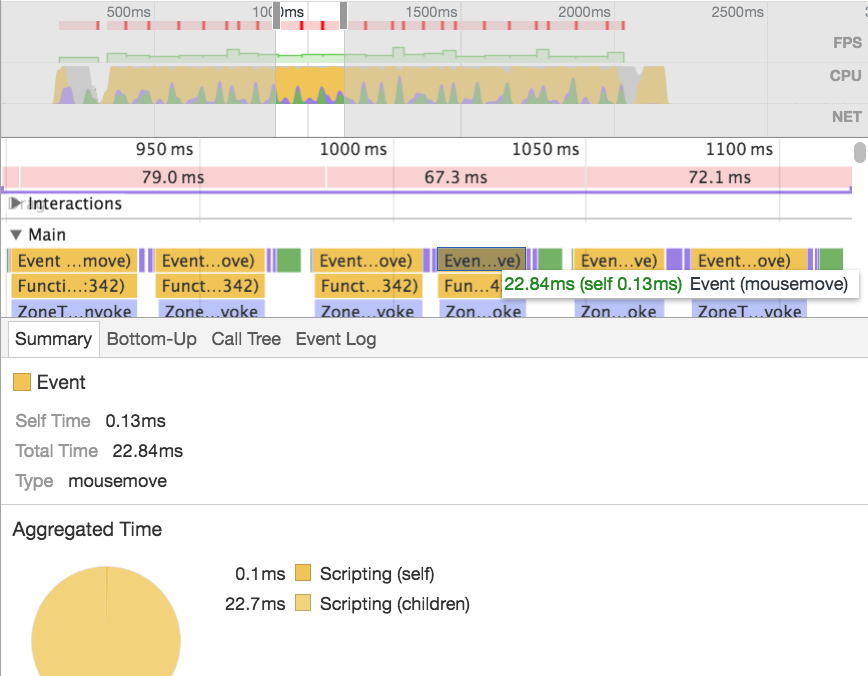
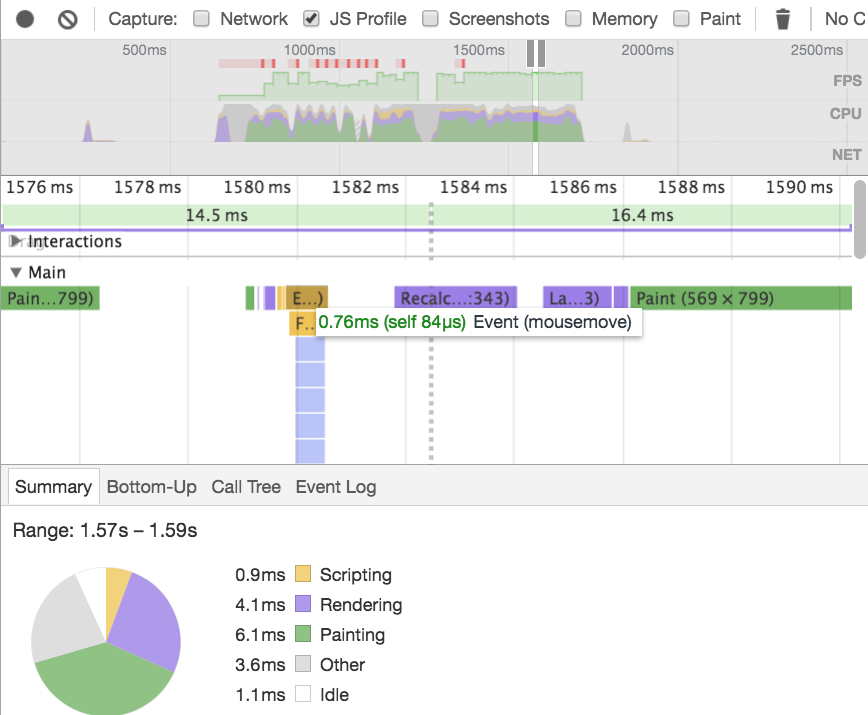

Angular claims to be very fast by default. What does "fast" really mean? Of course, this always depends on the context. What does our application do? How many different things is it doing at a certain point? How is our application's component tree structured and how many bindings does it introduce? This and other questions come into play when trying to figure out, how we can make our applications faster.

A couple of weeks ago, I had the honour to give a [talk](https://www.youtube.com/watch?v=FIi6AkI7wKE) about [Angular and React - Friends learning from each other](http://pascalprecht.github.io/slides/angular2-react/) at [NG-BE](https://ng-be.org/) together with [Oliver Zeigermann](http://twitter.com/DJCordhose), and we were discussing a demo application in which we compared the default performance and what we can do to make it faster. In this article we'd like to take this demo and show some tips and tricks to make it blazingly fast. One or the other trick might help speeding up **your** application as well.

**UPDATE:** We've written a follow-up article that discusses another option to make your app faster using [Zones in Angular](/angular/2017/02/02/making-your-angular-app-fast.html)
## Rendering 10000 draggable SVG boxes

Let's start off with the demo itself. We wanted to go with a scenario in which the framework reaches its boundaries, so that possible performance improvements are easier to visualise. This doesn't have to be a real world scenario, but rather challenging enough to showcase what we can do. That's why we decided to render 10000 **draggable** SVG boxes. Rendering 10000 SVG boxes isn't necessarily a hard nor realistic task, however, it gets quite interesting when each of these boxes need to be draggable, because... well whenever there's a `mousemove` event being fired, Angular has to perform change detection and rerender what needs to be rerendered. With 10000 boxes, this can be quite a lot of work.

> **Special Tip**: Learn in our article about [Angular's Change Detection](/angular/2016/02/22/angular-2-change-detection-explained.html) why it's performed on every `mousemove` event

The application consists of two components - `AppComponent` and `BoxComponent` -  here's what `AppComponent` looks like:

```js
@Component({
  selector: 'demo-app',
  template: `
    <svg (mousedown)="mouseDown($event)"
         (mouseup)="mouseUp($event)"
         (mousemove)="mouseMove($event)">

      <svg:g box *ngFor="let box of boxes" [box]="box">
      </svg:g>

    </svg>
  `
})
export class AppComponent implements OnInit {

  currentId = null;
  boxes = [];
  offsetX;
  offsetY;

  ngOnInit() {
    this.boxes = ... // generate 10000 random box coordinates
  }

  mouseDown(event) {
    const id = Number(event.target.getAttribute("dataId"));
    const box = this.boxes[id];
    this.offsetX = box.x - event.clientX;
    this.offsetY = box.y - event.clientY;
    this.currentId = id;
  }

  mouseMove(event) {
    event.preventDefault();
    if (this.currentId !== null) {
      this.updateBox(this.currentId, event.clientX + this.offsetX, event.clientY + this.offsetY);
    }
  }

  mouseUp() {
    this.currentId = null;
  }

  updateBox(id, x, y) {
    const box = this.boxes[id];
    box.x = x;
    box.y = y;
  }
}
```

Let's not get too overwhelmed by the code. The only really important parts here are:

- We have an SVG element with event handlers for `mousedown`, `mousemove` and `mouseup`
- We generate 10000 random coordinates for the boxes, which are rendered using `ngFor`
- We update the box that is being dragged in `mouseMove()`

Okay, next we take a look at the `BoxComponent`. 

```js
@Component({
  selector: '[box]',
  template: `
    <svg:rect
      [attr.dataId]="box.id"
      [attr.x]="box.x"
      [attr.y]="box.y"
      width="20"
      height="20"
      stroke="black"
      [attr.fill]="selected ? 'red' : 'transparent'"
      strokeWidth="1"></svg:rect>
  `
})
export class BoxComponent {
  @Input() box;
  @Input() selected;
}
```

This one really just renders an SVG rect element using a couple of bindings to set the coordinates from the given box object.

By clicking and dragging a box, we can see and feel that the app is quite [janky](http://jankfree.org/). Time to measure how fast it really is!

## Measuring the app's performance

We're interested in runtime performance and how long it takes Angular to perform a task when the `mousemove` event has been fired, as this is the work Angular has to do when we drag and drop a box.

Measuring these kind of things nowadays is fairly easy. Chrome's devtools for example come with an excellent **Timeline Tool** that lets us profile JavaScript execution and paint times per frame in the browser with a couple of mouse clicks.

Try it out yourself, all you need to do is:

- Open the devtools (ALT+CMD+I)
- Choose **Timeline**
- Press the record button in the top right corner or (CMD+E)
- Click and drag a box
- Stop the recording by clicking the red record button again

Ideally, any kind of measuring is done in an incognito browser tab so the recorded numbers won't be affected by resources used by browser extensions or other browser tabs. Also, try to measure not only once but rather 3-5 times as the results will always vary a little bit. This helps us coming up with a decent average value.

> **Special Tip**: Always profile in incognito tabs to makes sure recorded numbers aren't affected by browser extensions or tabs taking up resources.

Here are the numbers we measured on a MacBook Air (*1,7 GHz Intel Core i7, 8 GB DDR3*) in Chrome (*Version 55.0.2883.95 (64-bit)*):


- 1st Profile, Event (mousemove): **~40ms, ~52ms (fastest, slowest)**
- 2nd Profile, Event (mousemove): **~45ms, ~61ms (fastest, slowest)**
- 3rd Profile, Event (mousemove): **~41ms, ~52ms (fastest, slowest)**

Please note that there are multiple `mousemove` events being fired when moving the mouse, that's why we're showing fastest and slowest numbers. Also, these numbers might look different on your local machine. Okay, so it takes Angular roughly ~42ms - ~55ms in average to render 10000 boxes. That's not too bad, **considering that this is completely unoptimized**. However, we want to learn how to make it faster. Let's take a look!

## How to make it fast(er)

Again, Angular is very fast right out of the box. However, it turns out that there are a lot of things we can do to make our code even faster. The following are ideas for performance improvements we've came up with in collaboration with Angular's core team member Tobias, who mainly works on the compiler and kind of knows how to make things fast.

- <a href="#use-onpush-change-detection-strategy" title="Use OnPush to save bindings">ChangeDetectionStrategy.OnPush</a> - Use Angular's **OnPush** change detection strategy to save view bindings per change detection task
- <a href="#using-a-simpler-ngfor" title="Use SimpleNgFor">"Simple" NgFor</a> - Angular's **NgFor** directive is sometimes a little bit too smart. A simpler version of it could be faster
- <a href="#detach-change-detectors-from-change-detector-tree" title="Detach change detectors">Detach change detectors</a> - Another option is to **detach all change detectors** from the tree and only perform change detection for the components that is actually changing

### Use OnPush change detection strategy

Probably the most obvious thing to do. In our article on [Change Detection in Angular](/angular/2016/02/22/angular-2-change-detection-explained.html) we talked about how Angular's `OnPush` change detection strategy enables us to reduce the number of checks Angular has to make when a change in our application happens.

The idea is to make Angular only check a component's view bindings if one of its inputs have changed. In our demo, we have only two components - `AppComponent` and `BoxComponent` - and only `BoxComponent` is receiving inputs. If we set `BoxComponent`'s change detection strategy to `OnPush`, we should be able to save 4 bindings per box (4 bindings, because there are 4 property bindings in `BoxComponent`'s view). That is 39996 bindings in total (one box is changing). In order to use `OnPush` properly, we need to make two tiny changes in our code: Set the change detection strategy and make sure that `BoxComponent`'s input values are immutable.

Here's how we set the change detection strategy to `OnPush`:

```js
import { 
  Component,
  Input,
  ChangeDetectionStrategy
} from '@angular/core';

@Component({
  selector: '[box]',
  changeDetection: ChangeDetectionStrategy.OnPush, // set to OnPush
  ...
})
export class BoxComponent {
  @Input() box;
  @Input() selected;
}
```

To make all inputs immutable, we simply create new references every time we update a box:

```js
@Component(...)
class AppComponent {
  ...
  updateBox(id, x, y) {
    this.boxes[id] = { id, x, y }; // new references instead of mutation
  }
}
```

At this point it gets rather hard to notice an actual difference. This is because the previous unoptimized demo was already pretty fast. Let's measure again and see if our application is faster (these profiles are made on the same machine as the previous ones).


- 1st Profile, Event (mousemove): **~25ms, ~35ms (fastest, slowest)**
- 2nd Profile, Event (mousemove): **~21ms, ~44ms (fastest, slowest)**
- 3rd Profile, Event (mousemove): **~23ms, ~37ms (fastest, slowest)**

As we can see, using `OnPush` does indeed improve our runtime performance. We may not notice a huge visual difference, but as we can see in the numbers, our application is now about as twice as fast. Considering the small change we needed to do, this is a great result!

It turns out, we could improve this even further. Right now, all 10000 boxes are checked, only the views are skipped - you know, the 39996 bindings. This is because in order to find out if an input has changed or not (to skip a component's view), Angular needs to check the component. We could introduce some kind of segmentation model that divides the 10000 boxes into, let's say ten, segments with 1000 boxes each. This would reduce the number of components to be checked to just 999.

However, this would not only make our code way more complicated, it also changes the application algorithm, which is what we're trying to avoid in the first place.

### Using a simpler NgFor

Another thing that is rather not obvious in our demo, is that `NgFor` might take up more time than it should. Now, what does that mean? Well, if we take a look at `NgFor`'s source code, we can see that it not only creates DOM items it iterates through, it also keeps track of the **position** of each item, in case things have been moved around. This is great for animations as we can animate-in and -out naturally.

In our demo however, we don't really move the items in the collection itself. In fact, we don't really touch it at all. So what if we can use a simpler `NgFor` that doesn't care about item positions in the collection? Creating such a directive requires a bit more work and it would not fit in the scope of this article, which is why we will discuss the implementation of `SimpleNgFor` in another article.



**SimpleNgFor (without OnPush)**

- 1st Profile, Event (mousemove): **~45ms, ~50ms (fastest, slowest)**
- 2nd Profile, Event (mousemove): **~43ms, ~53ms (fastest, slowest)**
- 3rd Profile, Event (mousemove): **~42ms, ~50ms (fastest, slowest)**

**SimpleNgFor (with OnPush)**

- 1st Profile, Event (mousemove): **~22ms, ~32ms (fastest, slowest)**
- 2nd Profile, Event (mousemove): **~22ms, ~39ms (fastest, slowest)**
- 3rd Profile, Event (mousemove): **~21ms, ~30ms (fastest, slowest)**

We've performed six measurements in total, three for the demo with just the `SimpleNgFor` directive and another three with `OnPush` enabled. As we can see, `SimpleNgFor` improves the numbers a little tiny bit. Again, if you profile on your local machine, those numbers might be different. Considering the amount of work that needs to be done to create `SimpleNgFor`, it's **probably not worth it** if we only save ~5ms in average.

### Detach change detectors from change detector tree

Angular is pretty powerful when it comes to giving us developers control over  how things are processed in the platform. `OnPush` enables us to decide when and where in the component tree change detection is skipped when a change has happened. While this is already super powerful, it turns out that there can be cases where even that is not enough. That's why Angular gives us access to `ChangeDetectorRef`'s of each component, with which we can enable or disable change detection entirely. We touched on that in our article on [change detection in Angular](/angular/2016/02/22/angular-2-change-detection-explained.html) as well, but let's discuss how this is useful in our demo application.

We're dealing with 10000 draggable SVG boxes and all of them are checked on every change (every `mousemove` event). As discussed earlier, as of how our application is constructed right now,  `OnPush` doesn't prevent Angular from checking the boxes themselves, only their views. However, what if we could turn off change detection entirely for all components and only perform change detection for the box component that is actually being moved? This would obviously result in way less work per task as we aren't checking 10000 boxes anymore, but only one.

How do we get there? The first thing we do is, we detach the component's change detectors from the tree. We can inject a component's `ChangeDetectorRef` using DI and use its `detach()` method for that. The only thing we need to keep in mind is that we only want to detach the change detectors after change detection has been performed for the first time, otherwise we won't see any boxes. To call `detach()` in the right moment, we can take advantage of Angular's `AfterViewInit` life cycle hook.

Here's what that looks like:

```js
import { AfterViewInit, ChangeDetectorRef } from '@angular/core';

@Component(...)
class AppComponent implements AfterViewInit {
  ...
  constructor(private cdr: ChangeDetectorRef) {}

  ngAfterViewInit() {
    this.cdr.detach();
  }
}
```

We do exactly the same for the all box components.

```js
@Component(...)
class BoxComponent implements AfterViewInit {
  ...
  constructor(private cdr: ChangeDetectorRef) {}

  ngAfterViewInit() {
    this.cdr.detach();
  }
}
```

Okay cool, now we should see all the boxes but the dragging and dropping doesn't work anymore. That makes sense because change detection is turned off entirely and no handlers for any events are executed anymore.

The next thing we need to do, is to make sure that change detection is performed for the box that is being dragged. We can extend our `BoxComponent` to have a method `update()` which performs change detection just like this:

```js
@Component(...)
class BoxComponent implements AfterViewInit {
  ...
  update() {
    this.cdr.detectChanges();
  }
}
```

Cool, now we need to call this method whenever needed. This is essentially in our `mouseDown()`, `mouseMove()` and `mouseUp()` handlers. But how to do we get access to that one particular box component instance that is touched? Simply relying on `this.boxes[id]` doesn't do the trick anymore because it's not an instance of `BoxComponent`. We need to extend the `event` object with such an instance so we access it accordingly.

**This is where it gets a liiiittle hacky**. We could expect the `BoxComponent` instance on the DOM event object we get from the `mousedown` event like this:

```js
@Component(...)
export class AppComponent implements AfterViewInit {
  ...
  mouseDown(event) {
    const boxComponent = <BoxComponent> event.target['BoxComponent'];

    const box = boxComponent.box;
    const mouseX = event.clientX;
    const mouseY = event.clientY;
    this.offsetX = box.x - mouseX;
    this.offsetY = box.y - mouseY;

    this.currentBox = boxComponent;

    boxComponent.selected = true;
    boxComponent.update();
  }
}
```

To make the box component instance available on `event.target`, where `target` is the underlying SVG rect element, we can access it as a view child of `BoxComponent` and extend it with a new property that has the `BoxComponent` instance. We also add a local template variable `#rect` to the SVG element, so that `ViewChild('rect')` can query it accordingly.

```js
@Component({
  selector: '[box]',
  template: `
    <svg:rect #rect ...></svg:rect>
  `
})
export class BoxComponent implements AfterViewInit {

  @ViewChild('rect')
  set rect(value: ElementRef) {
    if (value) {
      value.nativeElement['BoxComponent'] = this;
    }
  }
  ...
}
```

Great! We can now go ahead and use `BoxComponent.update()` in all other methods where needed.



JavaScript execution time is now **always below 1ms**, which makes sense as Angular has to only check the box component that is dragged by the user. This shows very nicely how much control Angular gives us as developers and how we can take advantage of that for our specific needs.

## Conclusion

Angular is very fast by default and still, it gives us tools to fine tune the performance of our applications by handing over a lot of control over how change detection is performed. Is there anything else we can do? It turns out yes.

**All demos have been executed in Angular's dev mode**. We can turn on production mode, which should increase performance a little bit further as it makes sure to run change detection only once, as opposed to twice in dev mode.

We should keep in mind though, that none of the shown tricks is a silver bullet. They may or may not work for your particular use case. 

Hopefully you've learned one or the other thing about how to make your apps faster!

