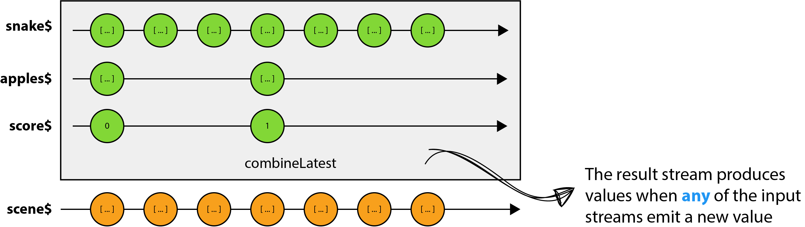

The web moves quickly and we all know it. Today, Reactive Programming is one of the hottest topics in web development and with frameworks like Angular or React, it has become much more popular especially in the modern JavaScript world. There's been a massive move in the community from imperative programming paradigms to functional reactive paradigms. Yet, many developers struggle with it and are often overwhelmed by its complexity (large API), fundamental shift in mindset (from imperative to declarative) and the multitude of concepts.

While this is not always the easiest thing to do, once we get the hang of it we'll ask ourselves **how did we live without it?**

This article is not meant to be an introduction to reactive programming and if you are completely new to it, we recommend the following resources:

- [Introduction to Reactive Programming](https://egghead.io/courses/introduction-to-reactive-programming) by [André Staltz](https://twitter.com/andrestaltz)
- [RxJS 5 Thinking Reactively](https://www.youtube.com/watch?v=3LKMwkuK0ZE) by [Ben Lesh](https://twitter.com/BenLesh)
- [RxJS 5 Ultimate](https://chrisnoring.gitbooks.io/rxjs-5-ultimate/content/) by [Chris Noring](https://twitter.com/chris_noring)
- [Learn RxJS](https://www.learnrxjs.io/) by [Brian Troncone](https://twitter.com/btroncone)
- [RxJS 5 Operators By Example](https://gist.github.com/btroncone/d6cf141d6f2c00dc6b35) by [Brian Troncone](https://twitter.com/btroncone)

The goal of this post is to learn how to think reactively by building a classic video game that we all know and love - Snake. That's right, a video game! They are fun but complex systems that keep a lot of external state, e.g. scores, timers, or player coordinates. For our version, we'll make heavy use of Observables and use several different operators to completely avoid external state. At some point it might be tempting to store state outside of the Observable pipeline but remember, we want to embrace reactive programming and don't rely on a single external variable that keeps state.

**Note**: We'll solely use **HTML5** and **JavaScript** together with [RxJS](http://reactivex.io/rxjs/) to transform a programmatic-event-loop into a reactive-event-driven app.

The code is available on [Github](https://github.com/thoughtram/reactive-snake) and a live demo can be found [here](https://stackblitz.com/edit/reactive-snake?file=main.ts). I encourage you to clone the project, fiddle with it and implement cool new game features. If you do, ping me on [Twitter](https://twitter.com/elmd_).

<div class="thtrm-toc is-sticky" markdown="1">
### TABLE OF CONTENTS
{:.no_toc}
* TOC
{:toc}
</div>

## The game

As mentioned earlier, we are going to re-create Snake, a classic video game from the late 1970s. But instead of simply copying the game, we add a little bit of variation to it. Here's how the game works.

As a player you control a line that resembles a hungry snake. The goal is to eat as many apples as you can to grow as long as possible. The apples can be found at random positions on the screen. Each time the snake eats an apple, its tail grows longer. Walls will not stop you! But listen up, you must try to avoid hitting your own trail at all costs. If you don't, the game is over. How long can you survive?

Here's a preview of what we are going to build:


For this specific implementation the snake is represented as a line of blue squares where its head is painted in black. Can you tell how the fruits look? Exactly, red squares. Everything is a square and that's not because they look so beautiful but they are very simple geometric shapes and easy to draw. The graphics are not very shiny but hey, it's about making the shift from imperative programming to reactive programming and not about game art.

## Setting up the stage

Before we can start with the game's functionality, we need set up a `<canvas>` element that gives us powerful drawing APIs from within JavaScript. We'll use the canvas to draw our graphics including the playing area, the snake, the apples and basically everything we need for our game. In other words, the game will be rendered entirely on the `<canvas>` element.

If this is completely new to you, check out [this](https://egghead.io/courses/learn-html5-graphics-and-animation) course on egghead by Keith Peters.

The `index.html` is quite simple because most of the _magic_ happens with JavaScript.

```html
<html>
<head>
  <meta charset="utf-8">
  <title>Reactive Snake</title>
</head>
<body>
  <script src="/main.bundle.js"></script>
</body>
</html>
```

The script that we add to the body is essentially the output of the build process and contains all of our code. However, you may be wondering why there is no such `<canvas>` element inside the `<body>`. It's because we'll create that element using JavaScript. In addition, we add a few constants that define how many `rows` and `columns` we have as well as the `width` and `height` of the canvas.

```js
export const COLS = 30;
export const ROWS = 30;
export const GAP_SIZE = 1;
export const CELL_SIZE = 10;
export const CANVAS_WIDTH = COLS * (CELL_SIZE + GAP_SIZE);
export const CANVAS_HEIGHT = ROWS * (CELL_SIZE + GAP_SIZE);

export function createCanvasElement() {
  const canvas = document.createElement('canvas');
  canvas.width = CANVAS_WIDTH;
  canvas.height = CANVAS_HEIGHT;
  return canvas;
}
```

With that in place we can call this function, create a `<canvas>` element on the fly and append it to the `<body>` of our page:

```js
let canvas = createCanvasElement();
let ctx = canvas.getContext('2d');
document.body.appendChild(canvas);
```

Note that we are also getting a reference to the `CanvasRenderingContext2D` by calling `getContext('2d')` on the `<canvas>` element. This 2D rendering context for the canvas allows us to draw for example rectangles, text, lines, paths and much more.

We're good to go! Let's start working on the core mechanics of the game.

## Identifying the source streams

From the preview and the game description we know that we need the following features:

- Navigate the snake using the arrow keys
- Keep track of the player's score
- Keep track of the snake (includes eating and moving)
- Keep track of the apples on the field (includes generating new apples)

In reactive programming it's all about programming with data streams, streams of input data. Conceptually, when a reactive program is executed, it sets up an observable pipeline that acts upon changes, e.g. a user has interacted with the application by pressing a key on the keyboard or simply a tick of an interval. So it's all about figuring out **what can change**. Those _changes_ often define the **source streams**. The key is to come up with the streams that represent the **primary source of change** and then compose them together to calculate whatever you need, e.g. the game state.

Let's try to find our source streams by looking at the featurs above.

First of all, user input is definitely something that will change over time. The player navigates the hungry snake using the arrow keys. That means our first source stream is `keydown$` which will emit values whenever a key is pressed down.

Next we need to keep track of the player's score. The score basically depends on how many apples the snake has eaten. We could say that the score depends on the length of the snake because whenever the snake grows we want to increase the score by `1`. Therefore, our next source stream is `snakeLength$`.

Again, it is important to figure out the **main** sources from which we can compute whatever you need, e.g. the score. In most cases, the source streams are combined and refined into more concrete streams of data. We'll see this in action in a minute. For now, let's continue with identifying our main source streams.

So far, we got the user input and the score in place. What's left are the more **game-facing** or **interactive** streams, such as the snake or the apples.

Let's start with the snake. The core mechanic of the snake is simple; it moves over time and the more apples it eats the bigger it grows. But what exactly is the **source** of the snake? For now, we can forget about the fact that it eats and grows because what matters is that it primarily depends on a **time factor** as it moves **over time**, e.g. `5` pixels every `200ms`. So our source stream is an interval that produces a value after each period and we call this `ticks$`. This stream also determines the speed of our snake.

Last but not least the apples. With everyting else in place, the apples are farily easy. This stream basically depends on the snake. Everytime the snake moves we check whether the head collides with an apple or not. If it does, we remove that apple and generate a new one at a random position on the field. That said, we don't need to introduce a new source stream for the apples.

Great, that's it for the source streams. Here's a brief overview of the all source streams we need for our game:

- `keydown$`: keydown events (KeyboardEvent)
- `snakeLength$`: represents the length of the snake (Number)
- `ticks$`: interval that represents the pace of the snake (Number)

These source streams build the basis for our game from which we can calculate all other values we need including the score, snake and apples.

In the next sections we'll look closely at how to implement each of these source streams and compose them to generate the data we need.

## Steering the snake

Let's dive right into code and implement the steering mechanism for our snake. As mentioned in the previous section the steering depends on keyboard inputs. Turns out it's deceptively simple and the first step is to create an observable sequence from keyboard events. For this we can leverage the `fromEvent()` operator:

```js
let keydown$ = Observable.fromEvent(document, 'keydown');
```

This is our very first source stream and it will emit a `KeyboardEvent` everytime the user presses down a key. Note that literally every `keydown` event is emitted. Therefore, we also get events for keys that we are not really interested in and that's basically everything else but the arrow keys. But before we tackle this specific issue, we define a constant map of directions:

```js
export interface Point2D {
  x: number;
  y: number;
}

export interface Directions {
  [key: number]: Point2D;
}

export const DIRECTIONS: Directions = {
  37: { x: -1, y: 0 }, // Left Arrow
  39: { x: 1, y: 0 },  // Right Arrow
  38: { x: 0, y: -1 }, // Up Arrow
  40: { x: 0, y: 1 }   // Down Arrow
};
```

By looking at the `KeyboardEvent` object it appears that every key has a unique `keyCode`. In order to get the codes for the arrow keys we can use [this](https://developer.mozilla.org/en-US/docs/Web/API/KeyboardEvent/keyCode) table.

Each direction is of type `Point2D` which is simply an object with an `x` and `y` property. The value for for each property can either be `1`, `-1` or `0`, indicating where the snake should be heading. Later, we'll use the direction to derive the new grid position for the snake's head and tail.

### The direction$ stream

So, we already have a stream for `keydown` events and everytime the player presses down a key we need to **map** the value, which will be a `KeyboardEvent`, to one of the direction vectors above. For that we can use the `map()` operator to project each keyboard event to a direction vector.

```js
let direction$ = keydown$
  .map((event: KeyboardEvent) => DIRECTIONS[event.keyCode])
```

As mentioned earlier, we'll receive **every** keydown event because we are not filtering out the ones that we are not interested in, such as the character keys. However, one could argue that we are already filtering out events by looking them up in the directions map. For every `keyCode` that is not defined in that map it will return `undefined`. Nevertheless, that's not really filtering out values on the stream which is why we can use the `filter()` operator to only pipe through desired values.

```js
let direction$ = keydown$
  .map((event: KeyboardEvent) => DIRECTIONS[event.keyCode])
  .filter(direction => !!direction)
```

Ok, that was easy. The code above is perfectly fine and works as expected. However, there's still some room for improvement. Can you think of something?

Well, one thing is that we want to prevent the snake from going into the opposite direction, e.g. from right to left or up and down. It doesn't really make sense to allow such behavior because the number one rule is to avoid hitting your own trail, remember?

The solution is fairly easy. We cache the previous direction and when a new event is emitted we check if the new direction is not equal to the opposite of the last one. Here's a function that calculates the `next` direction:

```js
export function nextDirection(previous, next) {
  let isOpposite = (previous: Point2D, next: Point2D) => {
    return next.x === previous.x * -1 || next.y === previous.y * -1;
  };

  if (isOpposite(previous, next)) {
    return previous;
  }

  return next;
}
```

This is the first time we are tempted to store state outside of the Observable pipeline because we somehow need to keep track of the previous direction right? An easy solution is to simply keep the previous direction in an external state variable. But wait! We wanted to avoid this, right?

To avoid external state, we need a way to sort of aggregate infinite Observables. RxJS has a very convenient operator we can use to solve our problem - `scan()`.

The `scan()` operator is very similar to `Array.reduce()` but instead of only returning the last value, it emits each intermediate result. With `scan()` we can basically accumulate values and reduce a stream of incoming events to a single value infinitely. This way we can keep track of the previous direction without relying on external state.

Let's apply this and take a look at our final `direction$` stream:

```js
let direction$ = keydown$
  .map((event: KeyboardEvent) => DIRECTIONS[event.keyCode])
  .filter(direction => !!direction)
  .scan(nextDirection)
  .startWith(INITIAL_DIRECTION)
  .distinctUntilChanged();
```

Notice that we are using `startWith()` to emit an inital value before beginning to emit values from the source Observable (`keydown$`). Without this operator our Observable would start emitting only when the player presses a key.

The second improvement is to _only_ emit values when the emitted direction is different from the previous one. In other words, we only want **distinct** values. You might have noticed `distinctUntilChanged()` in the snippet above. This operator does the dirty work for us and suppresses duplicate items. Note that `distinctUntilChanged()` only filters out identical values unless a different one is emitted in between.

The following figure visualizes our `direction$` stream and how it works. Values painted in blue represent initial values, yellow means the value was changed on the Observable pipeline and values emitted on the **result** stream are colored orange.


## Keeping track of the length

Before we implement the snake itself, let's come up with an idea to keep track of its length. Why do we need the length in the first place? Well, we use that information to model the score. It's right that in an imperative world we'd simply check if there was a collision whenever the snake moves and if that's the case we increase the score. So there is actually no need to keep track of the length. However, it would introduce yet another external state variable which we want to avoid at all costs.

In a reactive world it's a bit different. One naive approach could be to use the `snake$` stream and every time it emits a value we know that the snake has grown in length. While it really depends on the implementation of `snake$`, this is not how we'll implement it. From the beginning we know that it depends on `ticks$` as it moves a certain distance over time. As such, `snake$` will accumulate an array of body segments and because it's based on `ticks$` it will generate a value every `x` milliseconds. That said, even if the snake does not collide with anything, `snake$` will still produce distinct values. That's because the snake is constantly moving on the field and therefore the array will always be different.

This can be a bit tricky to grasp because there are some peer dependencies between the different streams. For example `apples$` will depend on `snake$`. The reason for this is that, everytime the snake moves we need the array of body segments to check if any of these pieces collides with an apple. While the `apples$` stream itself will accumulate an array of apples, we need a mechanism to model collisions that, at the same time, avoids a circular dependency.

### BehaviorSubject to the rescue

The solution to this is that we'll implement a _broadcasting_ mechanism using a `BehaviorSubject`. RxJS offers different types of Subjects with different functionalities. As such, the `Subject` class provides the base for creating more specialized Subjects. In a nutshell, a Subject is a type that implements both `Observer` and `Observable` types. Observables define the data flow and produce the data while Observers can subscribe to Observables and receive the data.

A `BehaviorSubject` is a more specialized Subject that represents a value that changes over time. Now, when an Observer subscribes to a `BehaviorSubject`, it will receive the last emitted value and then all subsequent values. Its uniqueness lies in the fact that it requires a **starting value**, so that all Observers will at least receive one value on subscription.

Let's go ahead and create a new `BehaviorSubject` with an initial value of `SNAKE_LENGTH`:

```js
// SNAKE_LENGTH specifies the inital length of our snake
let length$ = new BehaviorSubject<number>(SNAKE_LENGTH);
```

From here it's only a small step to implement `snakeLength$`:

```js
let snakeLength$ = length$
  .scan((step, snakeLength) => snakeLength + step)
  .share();
```

In the code above we can see that `snakeLength$` is based on `length$` which is our `BehaviorSubject`. This means that whenever we feed a new value to the Subject using `next()`, it will be emitted on `snakeLength$`. In addition, we use `scan()` to accumulate the length over time. Cool, but you may be wondering what that `share()` is all about, right?

As already mentioned, `snakeLength$` will later be used as an input for `snake$` but at the same time acts as a source stream for the player's score. As a result, we would end up **recreating** that source stream with the second subscriptions to the same Observable. This happens because `length$` is a **cold** Observable.

If you are completely new to hot and cold Observables, we have written an article on [Cold vs Hot Observables](/angular/2016/06/16/cold-vs-hot-observables.html).

The point is that, we use `share()` to allow multiple subscriptions to an Observable that would otherwise recreate its source with every subscription. This operator automatically creates a Subject between the original source and all future subscribers. As soon as the number of subscribers goes from zero to one it will connect the Subject to the underlying source Observable and broadcast all its notifications. All future subscribers will be connected to that in-between Subject, so that effectively there's just one subscription to the underlying cold Observable. This is called **multicasting** and will make you stand out on dinner parties.

Awesome! Now that we have a mechanism that we can use to broadcast values to multiple subscribers, we can go ahead and implement `score$`.

### Implementing score$

The player's score is as simple as it can get. Equipped with `snakeLength$` we can now create the `score$` stream that simply accumulates the player's score using `scan()`:

```js
let score$ = snakeLength$
  .startWith(0)
  .scan((score, _) => score + POINTS_PER_APPLE);
```

We basically use `snakeLength$` or rather `length$` to notify subscribers that there's been a collision and if there was, we just increase the score by `POINTS_PER_APPLE`, a constant amount of points per apple. Note that `startWith(0)` must be added before `scan()` to avoid specifying a _seed_ (initial accumulator value).

Let's look at a more visual representation of what we just implemented:


By looking at the figure above you may be wondering why the initial value of the `BehaviorSubject` only shows up on `snakeLength$` and is missing on `score$`. That's because the first subscriber will cause `share()` to subscribe to the underlying data source and because the underlying data source immediately emits a value, the value has already passed by the time that the subsequent subscriptions has happened.

Sweet. With that in place, let's implement the stream for our snake. Isn't this exciting?

## Taming the snake$

So far, we have learned a bunch of operators and we can use them to implement our `snake$` stream. As discussed in the beginning of this post, we need some sort of _ticker_ that keeps our hungry snake moving. Turns out there's a handy operator for that called `interval(x)` which emits a value every `x` milliseconds. We'll call each value _tick_.

```js
let ticks$ = Observable.interval(SPEED);
```

From here it's only a small stretch to the final `snake$` stream. For every _tick_, depending on whether the snake has eaten an apple, we want to either move it foward or add new segment. Therefore, we can use the all so familiar `scan()` operator to accumulate an array of body segments. But, as you may have guessed, we're facing a problem. Where's the `direction$` or `snakeLength$` stream coming into play?

Absolutely legitimate question to ask. The direction nor the snake's length is easily accessible from within our `snake$` stream unless we kept those information in a variable outside of the Observable pipeline. But again, we would be breaking our rule of not modifying external state.

Luckily, RxJS offers yet another very convenient operator called `withLatestFrom()`. It's an operator used to combine streams and that's exactly what we're looking for. This operator is applied to a _primary_ source that controls when data is emitted on the result stream. In other words, you can think of `withLatestFrom()` as a way to **throttle** the output of a secondary stream.

With the above, we have the tools we need to finally implement the hungry `snake$`:

```js
let snake$ = ticks$
  .withLatestFrom(direction$, snakeLength$, (_, direction, snakeLength) => [direction, snakeLength])
  .scan(move, generateSnake())
  .share();
```

Our _primary_ source is `ticks$` and whenever a new value comes down the pipe, we take the latest
values from both `direction$` and `snakeLength$`. Note that even if the _secondary_ streams frequently emit values, for example if the player is smashing his head on the keyboard, we'd only be proccessing the data for each _tick_.

In addition, we are passing a **selector** function to `withLatestFrom` which is invoked when the _primary_ stream produces a value. This function is optional and if omitted, a list with all elements is yielded.

We'll leave out the explanation for the `move()` function as the primary goal of this post is to facilitate the fundamental shift in mindset. Nonetheless, you can find the source code for this on [GitHub](https://github.com/d3lm/reactive-snake/blob/master/src/utils.ts#L25-L45).

Here's a figure that visually demonstrates the code above:


See how we _throttle_ `direction$`? The point is that `withLatestFrom()` is very practical when you want to **combine** multiple streams and you are not interested in producing values on the Observable pipeline when **either** of the streams emit data.

## Generating apples

You may notice that implementing our core building blocks for the game becomes easier as we learn more and more operators. If you made it so far then the rest is going to be easy peasy.

So far we have implemented a couple of streams such as `direction$`, `snakeLength$`, `score$` and `snake$`. If we combine them together we could already navigate that beast of snake around. But what is this game if there's nothing to devour. Quite boring.

Let's generate some apples to satisfy our snake's appetite. First, let's clarify what the state we need to preserve. Well, it could either be a single object or an array of objects. For our implementation we go with an array of apples. You hear the bells ringing?

Right, we can use `scan()` again to accumulate an array of apples. We start with an initial value and every time the snake moves, we check if there was a collision. If that's the case, we generate a new apple and return a **new** array. This way we can leverage `distinctUntilChanged()` to filter out identical values.

```js
let apples$ = snake$
  .scan(eat, generateApples())
  .distinctUntilChanged()
  .share();
```

Cool! This means that whenever `apples$` produces a new value we can assume that our snake has devoured one of those tasty fruits. What's left is to increase to score and also notify other streams about this event, such as `snake$` that takes the latest value from `snakeLength$` to figure out whether to add a new body segment.

### Broadcasting events

Earlier we have implemented this **broadcasting** mechanism, remember? Let's use that to trigger the desired actions. Here's our code for `eat()`:

```js
export function eat(apples: Array<Point2D>, snake) {
  let head = snake[0];

  for (let i = 0; i < apples.length; i++) {
    if (checkCollision(apples[i], head)) {
      apples.splice(i, 1);
      // length$.next(POINTS_PER_APPLE);
      return [...apples, getRandomPosition(snake)];
    }
  }

  return apples;
}
```

A simple solution is to call `length$.next(POINTS_PER_APPLE)` right inside that `if` block. But then we're facing a problem because we couldn't extract this _utility_ method into its own module (ES2015 module). In ES2015 modules are stored in files and there's exactly one module per file. The goal is to organize our code in a way that is easy to maintain and to reason about.

A more _sophisticated_ solution is to introduce yet another stream called `applesEaten$`. This stream is based on `apples$` and every time a new value is emitted on the stream, we'd like to perform some kind of **action**, calling `length$.next()`. To do so we can use the `do()` operator which will execute some piece of code for each _event_.

Sounds feasible. But, we somehow need to **skip** the first (initial) value emitted by `apples$`. Otherwise we end up increasing the score right away which doesn't make much sense as the game has just started. Turns out RxJS has an operator for that, namely `skip()`.

The fact that `applesEaten$` only acts as a _publisher_ to notify other streams, there's not going to be an Observer subscribing to this stream. Therefore, we have to **manually** subscribe.

```js
let appleEaten$ = apples$
  .skip(1)
  .do(() => length$.next(POINTS_PER_APPLE))
  .subscribe();
```

## Putting everything together

At this point, we have implemented all core buildings blocks of our game and we are good to go to finally combine everything into one result stream - `scene$`. For that we'll use `combineLatest`. It's quite similar to `withLatestFrom` but different in detail. First, let's look at the code:

```js
let scene$ = Observable.combineLatest(snake$, apples$, score$, (snake, apples, score) => ({ snake, apples, score }));
```

Instead of throttling secondary streams, we are interested in an event whenever **any** of the _input_ Observables produces a new value. The last argument is again a selector function and we are simply taking all the values and returning an object that represents our **game state**. The game state contains everything that needs to be rendered onto the canvas.



### Maintaining performance

Not only in games but but also for web applications we aim for performance. Performance can mean a lot but in terms of our game, we'd like to redraw the whole scene 60 times per second.

We can do that by introducing another stream similar to `ticks$` but for rendering. Basically it's another interval:

```js
// Interval expects the period to be in milliseconds which is why we devide FPS by 1000
Observable.interval(1000 / FPS)
```

The problem is that JavaScript is single-threaded. The worst case is that we prevent the browser from doing anything so that it locks up. In other words, the browser may not be able to process all these updates quickly enough. The reason for this is that the browser is trying to render a frame and then it's immediately asked to render the next one. As a result, it drops the current one to keep up the speed. That's when animations start to look choppy.

Luckily, we can use `requestAnimationFrame` allowing the browser to line up work and perform it at the most appropriate time. But how do we use it for our Observable pipeline? The good news is that many operators including `interval()` take a `Scheduler` as its last argument. In a nutshell, a `Scheduler` is a mechanism to **schedule** some task to be performed in the future.

While RxJS offers a variety of Schedulers, the one that we're interested in is called `animationFrame`. This Scheduler performs a task when `window.requestAnimationFrame` would fire.

Perfect! Let's apply this to our interval and we'll call the resulting Observable `game$`:

```js
// Note the last parameter
const game$ = Observable.interval(1000 / FPS, animationFrame)
```

This interval will now produce values roughly every 16ms maintaining 60 FPS.

### Rendering the scene

What's left is to combine our `game$` with the `scene$`. Can you guess what operator we use for that? Remember, both streams emit at different intervals and the goal now is to render our scene onto the canvas, 60 times per second. We'll use `game$` as our **primary** stream and every time it emits a value we combine it with the **latest** value from `scene$`. Sounds familiar? Yes, we can use `withLatestFrom` again.

```js
// Note the last parameter
const game$ = Observable.interval(1000 / FPS, animationFrame)
  .withLatestFrom(scene$, (_, scene) => scene)
  .takeWhile(scene => !isGameOver(scene))
  .subscribe({
    next: (scene) => renderScene(ctx, scene),
    complete: () => renderGameOver(ctx)
  });
```

You may have spotted `takeWhile()` in the code above. It's another very useful operator that we can call on an exisiting Observable. It will return values from `game$` **until** `isGameOver()` returns `true`.

That's it! We have just implemented snake, fully reactively and without relying on any external state using nothing but Observables and operators provided by RxJS.

Here's a <a href="https://stackblitz.com/edit/reactive-snake?file=main.ts" target="_blank" style="border-bottom: 0;">live demo</a> for you to play with.

## Future work

The game is very basic and in a follow-up post we'll extend it with various features, one of which is restarting the whole game. In addition we'll look at how we could implement **pause** and **resume** as well as different **levels** of difficulty.

Stay tuned!

## Special Thanks

Special thanks to [James Henry](https://twitter.com/MrJamesHenry) and [Brecht Billiet](https://twitter.com/brechtbilliet) for their help with the code.
