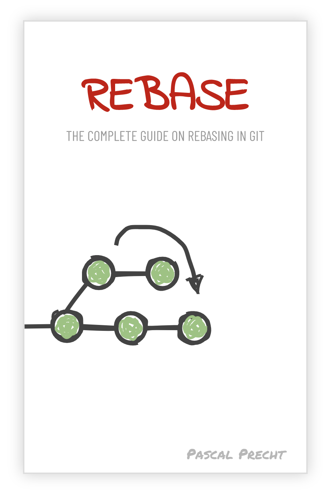

About fives years ago, when [Christoph](https://twitter.com/cburgdorf) and I started **thoughtram**, we thought it would be a cool idea to complement our [Git Master Class](https://thoughtram.io/git-master-class) with a self-published ebook that teaches you the ins and outs of the git version control system.

While we had a good start and actually managed to write a few chapters, we got side-tracked by our main business, which was training software developers all around the world in various technologies, and put the book to rest.

There are many people out there using git and most of them certainly get away with typical workflows like adding, committing, pushing and pulling changes. Some of them manage to survive merge conflicts without being scared to “mess things up”. However, the majority of software engineers (and any git user for that matter), feels rather uncomfortable when using the tools, especially when just knowing how to add and commit changes is not enough.

Therefore, I decided to resurrect the book we planned to write many years ago and give it a whole new identity. [Introducing REBASE](https://rebase-book.com).

REBASE not only aims to teach git users how to take back control of their commit histories through rebasing, but also to take away the fear of git being a super complex tool where “undoing things” is rather hard. With short and to the point chapters, hand-drawn illustrations and a pinch of simplicity, REBASE enables every reader to master git.

Even better, you don’t have to wait too long. I set myself a deadline to publish the book within two months. **A first version will be available on 31 January 2020**.

Head over to [rebase-book.com](https://rebase-book.com) and preorder the book!
